```{r}
#| label: setup
#| include: false
library(here)
source(here("utils","check_packages.R"))
source(here("utils","functions.R"))
library(gghighlight)
load(here("data","data_constructed","models.RData"))
load(here("data","data_constructed","partner_choice.RData"))
load(here("data", "data_constructed", "exogamy_trends.RData"))
load(here("data", "data_constructed", "sim_data.RData"))
load(here("data", "data_constructed", "tbl_counts.RData"))
```

```{r}
#| label: set-theme

theme_myslides <- theme_bw()+
  theme(plot.title = element_text(size=24, hjust=0),
        plot.title.position = "panel",
        plot.subtitle = element_text(size=16, hjust=0),
        plot.caption = element_text(size=14, hjust=1, vjust=1),
        plot.caption.position = "panel",
        text = element_text(colour="#131516"),
        axis.title = element_text(size=20),
        #axis.line = element_line(colour="#131516", size = 1),
        #axis.ticks = element_line(colour="#131516", size = 1),
        axis.text = element_text(size=18),
        legend.title = element_text(size=20),
        legend.text = element_text(size=18),
        strip.text = element_text(size = 18),
        #strip.background = element_rect(size = 2, fill = "grey", color = "black"),
        #panel.grid.major.x= element_blank(),
        panel.grid.minor = element_blank(), 
        #panel.border = element_rect(linewidth = 2),
        panel.background = element_rect(fill = "#F4F4F2",colour = NA),
        plot.background = element_rect(fill = "#F4F4F2",colour = NA),
        legend.background = element_rect(fill = "#F4F4F2",colour = NA),
        legend.key = element_rect(fill = "#F4F4F2",colour = NA), 
        legend.position = "bottom")
theme_set(theme_myslides)
```

```{r}
#| label: define-color-palette

my_palette <- c(
  "#1F4E79",  # slate blue (anchor)
  "#B06C2B",  # muted amber
  "#6B2C3E",  # burgundy
  "#2C5D63",  # deep teal
  "#8C8C8C"   # neutral gray (useful for reference group)
)
```

```{r}
#| label: create-coef-table

get_coefs <- function(x) {
  temp <- coef(x)[,c(1,2)]
  return(tibble(variable=rownames(temp), coef=temp[,1], se=temp[,2]))
}

coef_short_sym <- get_coefs(model_short_sym) |>
  filter(str_detect(variable, "race_exog")) |>
  mutate(variable=str_replace(variable, "race_exog_short_sym",""))

coef_short_asym <- get_coefs(model_short_asym) |>
  filter(str_detect(variable, "race_exog_short_asym")) |>
  mutate(variable=str_replace(variable, "race_exog_short_asym",""))

coef_full <- get_coefs(model_full_sym_multi) |>
  filter(str_detect(variable, "race_exog_full")) |>
  mutate(variable=str_replace(variable, "race_exog_full_sym",""))

coef_multi <- coef_short_sym |>
  filter(str_detect(variable, "Multi/Multi"))
```

## In Memoriam

:::: {.columns}

::: {.column .fragment .fade-in .slowfade}


:::

::: {.column .fragment .fade-in .slowfade}

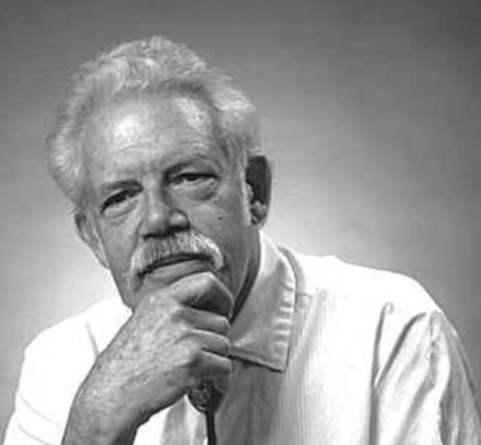

:::

::::


## The Biracial Baby Boom

```{r}
#| label: exogamy-trend-fig

exogamy_trend |>
  ggplot(aes(x = year, y = exogamy))+
  #geom_ribbon(aes(ymin = exogamy - 1.96 * exogamy_se,
  #                ymax = exogamy + 1.96 * exogamy_se),
  #            color = "grey", alpha = 0.5)+
  geom_line(linewidth = 1.5)+
  geom_point(size = 3)+
  scale_y_continuous(labels = scales::percent)+
  scale_x_continuous(breaks = seq(1960, 2020, 10))+
  labs(y = "Percent of married couples that\nidentify differently by race",
       caption = "Notes: Census and ACS data. Age weighted to match joint age distribution of newlywed couples.")
```

## Who do Multiracial Individuals Marry? {.smaller}

:::: {.columns}

::: {.column .fragment}

### Future racial composition

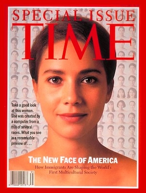

:::

::: {.column .fragment}

### Current racial boundaries

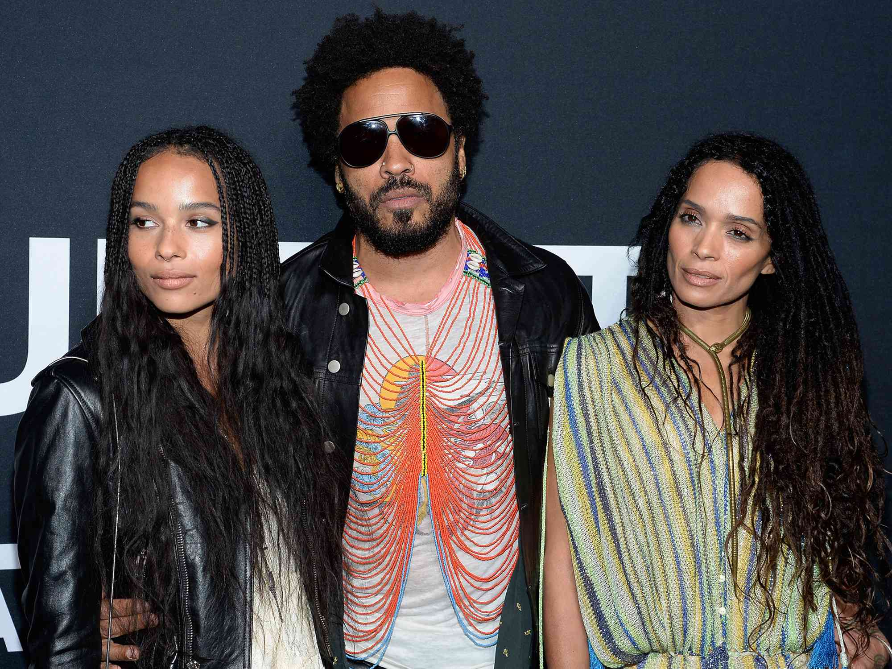

:::

::::

::: {.notes}

- Tells us about the likelihood of future

- Two columns
  - The concept of partial overlap
  - Regimes of classification
  
:::

## Multiraciality and Post-Racialism {.smaller}

:::: {.columns}

::: {.column width = "40%"}

*"The greatest hope for the immediate future lies in a lessening of the contrast between Negroes and whites... In a race of octoroons, living among whites, the color question would probably disappear."*

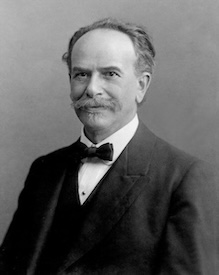

:::

::: {.column width = "60%"}

- Multiracial individuals have long been seen as the vanguard of a post-racial future. 
- Both popular and scholarly work focuses almost exclusively on the experience of first generation "biracial" individuals.
- Mixed race identity is treated as an absorbing state. The empirical evidence suggests otherwise:
  - Bratter (2007) shows that the children of multiracial parents are often identified by the single race shared with the other parent.
  - For mixed-race individuals with a deeper *generational locus*, multiracial ancestry may "fold back" into single race identification and classification.

:::

::::

## A Multigenerational Process

```{mermaid}
flowchart LR

%% Colors %%

classDef blue fill:#1F4E79,stroke:#000,color:#fff
classDef green fill:#6B2C3E,stroke:#000,color:#fff

%% GENERATION 4 %%
Fa1(White Man):::green --> G31(Interracial Marriage):::blue
Mo1(Asian Woman):::green --> G31

Fa2(White Man):::green --> G32(Same Race Marriage):::blue
Mo2(White Woman):::green --> G32


%% GENERATION 3 %%	
G31 --> Fa(White-Asian Man):::green --> G2("Interracial (?) Marriage"):::blue
G32 --> Mo(White Woman):::green --> G2

%% GENERATION 2 %%
G2 --> Or(?):::green
```


## Simulation Produces Surprising Results {.smaller}

::: {.r-stack}

```{r}
#| label: sim-groups-fig

plot_sim <- total_pop_group |>
  filter(mar_growth == "progress" & scenario == "high_decay" &
           pop_share == "uneven") |>
  mutate(year = year - 300,
         group = factor(group, levels = 1:3,
                        labels = c("Majority", "Minority", "Mixed"))) |>
  ggplot(aes(x = year, y = share, fill = group))+
  geom_area(color = NA)+
  scale_fill_manual(values = my_palette)+
  scale_y_continuous(labels = scales::percent)+
  labs(y = NULL)

plot_sim
```

::: {.fragment}

```{r}
#| label: sim-groups-fig-hl-mixed

plot_sim+
  gghighlight(group == "Mixed" | group == "Minority", use_direct_label = FALSE,
              unhighlighted_params = list(fill = NULL, alpha = 0.3))
```

:::

:::

## Concept of Partial Endogamy {.smaller}

:::: {.columns}

::: {.column width = "30%"}

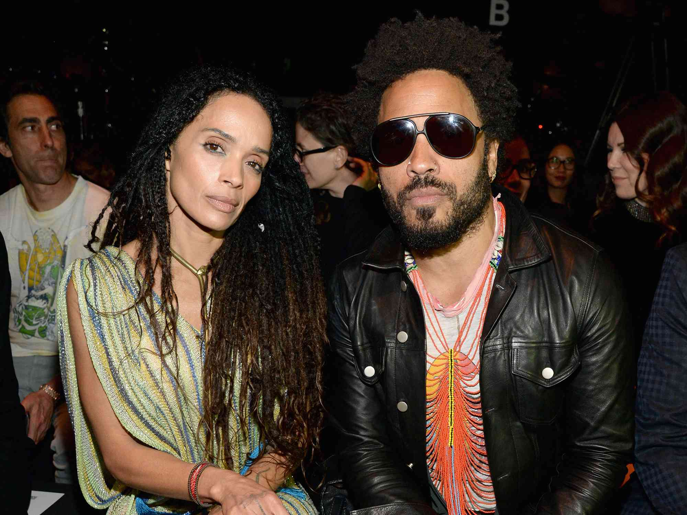

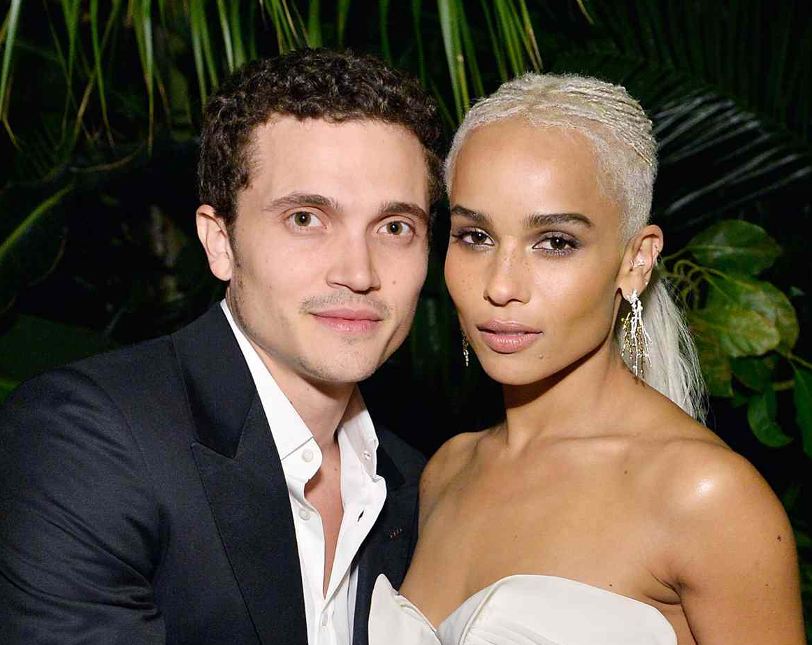

:::

::: {.column width = "70%"}

### What does "endogamy" mean for individuals of mixed race?

- A person might prefer a partner who shares the same racial mixture as themselves, leading to an *exact* match.
- But what if a Black-White individual marries a White person? Is this endogamy or exogamy?
- We consider this case of a *partial overlap* in racial identification to indicate *partial endogamy*.
- We expect partial endogamy to increase the likelihood of partnership but not as much as an *exact* match, adjusting for group sizes.

:::


::::

## Not All Partial Endogamy is Equal {.smaller}

:::: {.columns}

::: {.column width = "30%"}

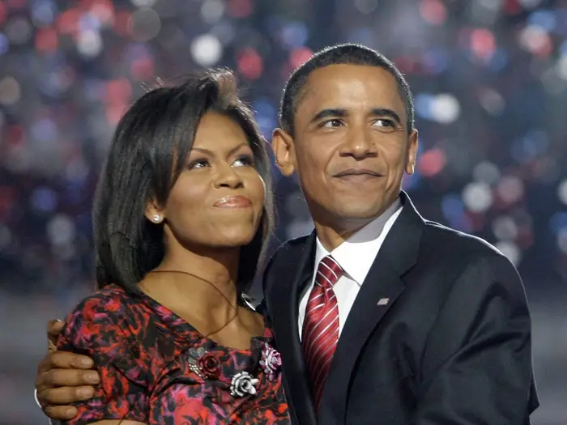


:::

::: {.column width = "70%"}

- *Regimes of racial classification* have long determined the racial classification of mixed race individuals.
  - **The One Drop Rule**: Black ancestry dominates.
  - **The Vanishing Indian**: Indigenous ancestry recedes.
  - White ancestry falls somewhere in the middle of these extremes. 
  - Greater flexibility/less historical precedent for the racial classification of Asian and Latino ancestry.
- We expect these regimes to affect the likelihood of partnership for multiracial individuals because it reflects how they are viewed as potential partners.
 
  
:::
  
::::

::: {.notes}

- For example, we expect that White-Black individuals will be more likely to marry Black partners than White partners, adjusting for group size.

:::

## Other Possible Patterns {.smaller}

:::: {.columns}

::: {.column .fragment}

### Shared Experience

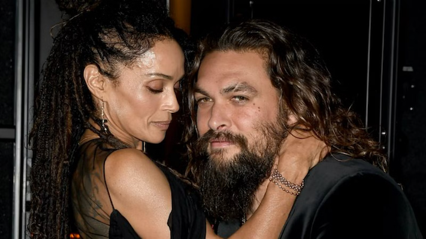

It is possible that the *shared experience of being multiracial* itself contributes to partner formation, regardless of specific ancestry.

:::

::: {.column .fragment}

### Transcendent Pattern

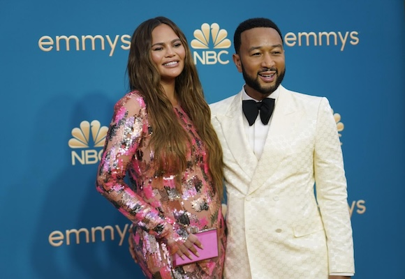

We might also expect a *transcendent pattern* in which multiracial individuals are more likely to cross racial boundaries in marriage generally.

:::

::::

## Data Sources {.smaller}

- American Community Survey (ACS) data from 2010-2019. 
- All opposite sex couples who were married in the last five years. 
- We use five large panethnic racial categories to sustain sample size for the analysis:
  - White
  - Black
  - Asian
  - Indigenous (American Indian, Alaska Native, and Pacific Islander)
  - Latino (identified via Hispanicity question)

::: {.callout-caution .fragment .fade-up}
Due to the combined question format of the ACS, we cannot identify multiracial individuals of part-Latino ancestry. 
:::

## Sample Size by Race

```{r}
#| label: sample-size-tbl

tbl_counts |>
  gt(rowname_col = "race") |>
  fmt_integer(starts_with("n_")) |>
  cols_label(
    race = "Race",
    n_union_w = "Wife",
    n_union_h = "Husband",
    n_alt_w = "Women",
    n_alt_h = "Men"
  ) |>
  cols_align(race, align = "left") |>
  tab_spanner(
    label = "Marriages",
    columns = starts_with("n_union_")
  ) |>
  tab_spanner(
    label = "Alternates",
    columns = starts_with("n_alt_")
  ) |>
  grand_summary_rows(fns = list(list(label = "Total", fn = "sum")),
                     fmt = ~ fmt_integer(.)) |>
  tab_options(table.background.color = "#F4F4F2", 
              table.font.size = px(18),
              heading.title.font.size = px(24),
              heading.subtitle.font.size = px(20))
```


## Race of Partner for Multiracial Spouses

::: {.r-stack}

```{r}
#| label: partner-choice-panel-color-fig

plot_partner_choice <- partner_choice |>
  ggplot(aes(x = fct_rev(race_spouse), y = prop, fill=overlap))+
  geom_col()+
  facet_wrap(~race_ego)+
  scale_fill_manual(values = my_palette)+
  scale_y_continuous(labels = scales::percent)+
  coord_flip()+
  labs(x=NULL, y="percent", fill = "overlap in racial identification")+
  theme(axis.text = element_text(size = 16))

plot_partner_choice
```

::: {.fragment}

```{r}
#| label: partner-choice-panel-color-fig-hl-exact

plot_partner_choice+
  gghighlight(overlap == "Exact", 
              use_direct_label = FALSE, calculate_per_facet = TRUE,
              unhighlighted_params = list(fill = NULL, alpha = 0.2))

```

:::

::: {.fragment}

```{r}
#| label: partner-choice-panel-color-fig-hl-partial

plot_partner_choice+
  gghighlight(overlap == "Partial", 
              use_direct_label = FALSE, calculate_per_facet = TRUE,
              unhighlighted_params = list(fill = NULL, alpha = 0.2))

``` 
 
:::

::: {.fragment}
 
```{r}
#| label: partner-choice-panel-color-fig-hl-white

plot_partner_choice+
  gghighlight(race_spouse == "White", 
              use_direct_label = FALSE, calculate_per_facet = TRUE,
              unhighlighted_params = list(fill = NULL, alpha = 0.2))

```

:::

:::

## Modeling Partner Choice {.smaller}

:::: {.columns}

::: {.column width = "30%"}

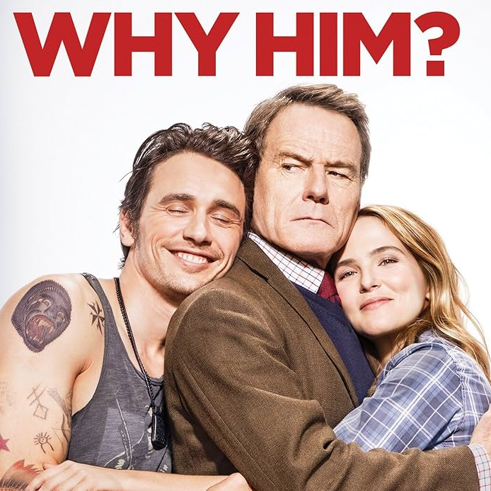

:::

::: {.column width = "70%"}

- For one randomly determined partner in a union, we randomly sample 7 alternate partners from a pool of possible alternates within the same geographic area.
- For each available choice set, we then use a **conditional logit model** to predict the actual union by a variety of shared characteristics of the (potential) partners:
  - racial combination (endogamy is the reference)
  - age difference of partners
  - educational distance
  - sharing a primary language
  - sharing a birthplace
- The model implicitly controls for group size differences in the local "marriage market."

:::

::::

## Multiracial-to-Multiracial Intermarriage

::: {.r-stack}

```{r}
#| label: multi-multi-fig

plot_multi_multi <- coef_full |>
  mutate(race_ego=str_split(variable, "\\.", simplify=TRUE)[,1],
         race_choice=str_split(variable, "\\.", simplify=TRUE)[,2],
         race_cons1=str_split(race_ego, "-", simplify=TRUE)[,1],
         race_cons2=str_split(race_ego, "-", simplify=TRUE)[,2],
         overlap=str_detect(race_choice, race_cons1) | 
           str_detect(race_choice, race_cons2),
         overlap = factor(overlap, 
                              levels = c(FALSE, TRUE),
                              labels = c("No overlap", "Partial overlap")),
         variable=str_replace(variable, "\\.","/")) |>
  mutate(variable = if_else(str_count(variable, "White") == 2, 
                            str_replace_all(variable, "White", "**White**"), 
                            variable),
         variable = if_else(str_count(variable, "Black") == 2, 
                            str_replace_all(variable, "Black", "**Black**"), 
                            variable),
         variable = if_else(str_count(variable, "Indigenous") == 2, 
                            str_replace_all(variable, "Indigenous", "**Indigenous**"), 
                            variable),
         variable = if_else(str_count(variable, "Asian") == 2, 
                            str_replace_all(variable, "Asian", "**Asian**"), 
                            variable)) |>
  ggplot(aes(x=reorder(variable, coef, max), y=exp(coef), color=overlap))+
  geom_linerange(linewidth=2.5, 
                 aes(ymax=exp(coef+1.386*se), ymin=exp(coef-1.386*se)))+
  geom_linerange(linewidth=1, 
                 aes(ymax=exp(coef+1.96*se), ymin=exp(coef-1.96*se)))+
  geom_point(size=4)+
  coord_flip()+
  scale_color_manual(values = my_palette)+
  ylim(0, 1)+
  labs(x=NULL, 
       y="odds of exogamous marriage with multiple race\npartner relative to multiracial endogamy",
       color="overlap in racial identification")+
  theme(axis.text.y = element_markdown())

plot_multi_multi
```

::: {.fragment}

```{r}
#| label: multi-multi-hl-no-overlap-fig

plot_multi_multi+
  gghighlight(overlap == "No overlap", use_direct_label = FALSE,
              unhighlighted_params = list(colour = NULL, alpha = 0.2))
```

:::

::: {.fragment}

```{r}
#| label: multi-multi-hl-overlap-fig

plot_multi_multi+
  gghighlight(overlap == "Partial overlap", use_direct_label = FALSE,
              unhighlighted_params = list(colour = NULL, alpha = 0.2))
```

:::

:::

## Simplified Multiracial-to-Multiracial Model

```{r}
#| label: multi-multi-fig-simplified

coef_short_sym |>
  filter(str_detect(variable, "Multi/Multi")) |>
  mutate(variable = str_remove(variable, "Multi/Multi, ")) |>
  ggplot(aes(x=variable, y=exp(coef), color = variable))+
  geom_linerange(linewidth=2.5, 
                 aes(ymax=exp(coef+1.386*se), ymin=exp(coef-1.386*se)))+
  geom_linerange(linewidth=1, 
                 aes(ymax=exp(coef+1.96*se), ymin=exp(coef-1.96*se)))+
  geom_point(size=4)+
  coord_flip()+
  scale_color_manual(values = my_palette)+
  ylim(0, 1)+
  labs(x=NULL, 
       y="odds of exogamous marriage with multiple race partner\nrelative to multiracial endogamy")+
  theme(legend.position = "none")
```


## Multiracial-to-Monoracial Intermarriage

::: {.r-stack}

```{r}
#| label: odds-ratios-single-fig

# the somewhat odd regular expression \\..*- will identify all the names with a 
# period followed by some characters followed by a dash. This will give
# me all cases of a single race/multiple race marriage
plot_multi_mono <- coef_short_sym |>
  filter(str_detect(variable, "\\..*-")) |>
  mutate(single_race = str_split(variable, "\\.", simplify=TRUE)[,1],
         multiple_race = str_split(variable, "\\.", simplify=TRUE)[,2],
         constituent = str_detect(multiple_race, single_race),
         single_race = factor(single_race, 
                            levels=c("Latino","Asian","Indigenous",
                                     "Black","White")),
         multiple_race = factor(multiple_race,
                              levels=c("White-Asian","Black-Asian",
                                       "White-Black","Black-Indigenous",
                                       "White-Indigenous","Asian-Indigenous")),
         constituent = factor(constituent, 
                              levels = c(FALSE, TRUE),
                              labels = c("None", "Partial")),
         upper84=exp(coef+1.386*se),
         upper95=exp(coef+1.96*se),
         lower84=exp(coef-1.386*se),
         lower95=exp(coef-1.96*se)) |>
  ggplot(aes(x=single_race, y=exp(coef), color=constituent))+
  geom_linerange(linewidth=2.5, 
                  aes(ymax=upper84, ymin=lower84))+
  geom_linerange(linewidth=1, 
                  aes(ymax=upper95, ymin=lower95))+
  geom_point(size=4)+
  coord_flip()+
  facet_wrap(~multiple_race, ncol=2)+
  scale_color_manual(values = my_palette)+
  ylim(0, 1)+
  labs(x=NULL, 
       y="odds of marriage with given single race partner relative to endogamy",
       color = "overlap in racial identification")

plot_multi_mono
```

::: {.fragment}

```{r}
#| label: odds-ratios-single-fig-hl-latino

plot_multi_mono+
  gghighlight(single_race == "Latino", use_direct_label = FALSE, 
              calculate_per_facet = TRUE,
              unhighlighted_params = list(colour = NULL, alpha = 0.2))
```

:::

::: {.fragment}

```{r}
#| label: odds-ratios-single-fig-hl-wa-wb

plot_multi_mono+
  gghighlight((multiple_race == "White-Asian" | multiple_race == "White-Black") &
                single_race != "Latino", 
              use_direct_label = FALSE, 
              calculate_per_facet = TRUE,
              unhighlighted_params = list(colour = NULL, alpha = 0.2))
```

:::

::: {.fragment}

```{r}
#| label: odds-ratios-single-fig-hl-wi

plot_multi_mono+
  gghighlight((multiple_race == "White-Indigenous") &
                single_race != "Latino", 
              use_direct_label = FALSE, 
              calculate_per_facet = TRUE,
              unhighlighted_params = list(colour = NULL, alpha = 0.2))
```

:::

::: {.fragment}

```{r}
#| label: odds-ratios-single-fig-hl-non-white

plot_multi_mono+
  gghighlight(!str_detect(multiple_race, "White") &
                single_race != "Latino", 
              use_direct_label = FALSE, 
              calculate_per_facet = TRUE,
              unhighlighted_params = list(colour = NULL, alpha = 0.2))
```

:::

:::

## Conclusions {.smaller}

- A high level of endogamy exists among multiracial individuals, masked by small group sizes.
- Partial overlap in racial identification increases the likelihood of partnering, but patterned by historical racial regimes.
  - Shared Black ancestry matters most.
  - Shared Indigenous ancestry matters least.
  - Shared White and Asian ancestry are somewhere in-between.
- No evidence of a postracial or transcendent pattern in partner choices.
- Despite a high level of endogamy, multiracial individuals are most likely to marry single-race individuals because of the small size of groups.
  - Inhibits formation of a sense of group identity.
  - part-White multiracial individuals are most likely to marry White partners, suggesting that multiracial identity may "fold" back into single race categories in the next generation.
  
___

:::: {.columns}

::: {.column width = "20%"}


:::

::: {.column width = "80%"}

::: {.nonincremental}
- Thank you for your time and questions!
- Check out the paper forthcoming in *Demography*!
:::

:::

::::

:::: {.columns}

::: {.column}


:::

::: {.column}

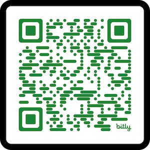

:::

::::
  